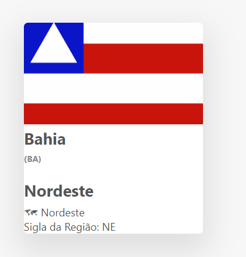

## API dos estados brasileiros

### Passo à passo:

1. Verificar o site do IBGE para saber como fazer a consulta da API. Link: https://servicodados.ibge.gov.br/api/v1/localidades/estados/ "ALGO DEVE SER ESCRITO AQUI" /
2. Verifique o código das siglas dos estados no site do IBGE.
3. Criar uma função que tenha como parâmetro a sigla do Estado.
4. Não esquecer do transformar em json()
5. A partir da resposta do passo 4, mostre o Estado, a sigla do Estado, a Região e a sigla da Região.
6. Para que a função da linha 3 seja satisfeita é necessário chamar a função renderregion. Para assim verificar a animação pequena animação.
7. Fica a dica no código: Verificar a função renderregion e digitar corretamente os parâmetros de cada campo. Ver exemplo 1. ☠☠☠

8. Ajustar o css para que ele apresente uma aparência melhor. Caso houver algum campo que não está sendo usado do css, o retire. O ajuste do css fica a critério de você, dev.
9. Utilizar o catch para verificar se o usuário digitou a sigla do estado corretamente.

10. Você conseguiu consumir a API do IBGE? Se chegou até aqui, então parabéns jovem, você conseguiu!!! 😜
